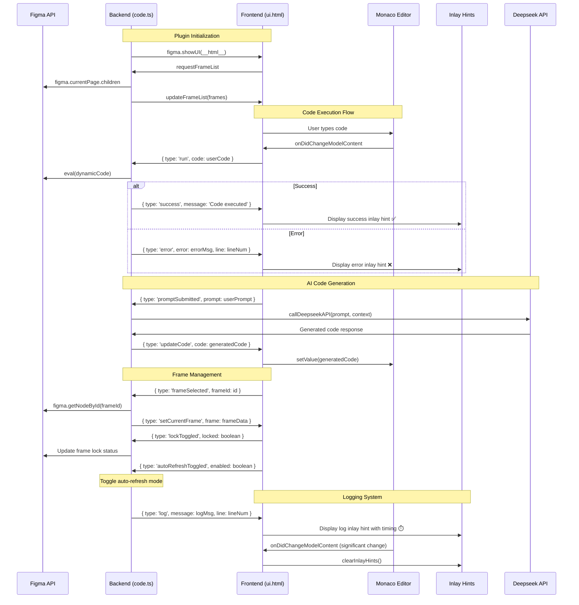

# Figma Plugin Architecture & Message Flow

This notebook documents the architecture and communication patterns between the Figma plugin backend (code.ts) and frontend (ui.html), including the newly implemented Quokka-style logging system using Monaco Editor's inlay hints.

## Architecture Overview

The following diagram shows the high-level architecture of the Figma plugin system:

```mermaid
architecture-beta
    group figma_env(cloud)[Figma Environment]
    group browser_env(internet)[Browser UI Environment]
    group external_api(server)[External Services]

    service figma_api(server)[Figma API] in figma_env
    service plugin_backend(database)[Plugin Backend] in figma_env
    service ui_frontend(browser)[UI Frontend] in browser_env
    service monaco_editor(code)[Monaco Editor] in browser_env
    service inlay_hints(errors)[Inlay Hints System] in browser_env
    service deepseek_api(agent)[Deepseek AI API] in external_api

    figma_api:R -- L:plugin_backend
    plugin_backend:B -- T:ui_frontend
    ui_frontend:R -- L:monaco_editor
    monaco_editor:R -- L:inlay_hints
    plugin_backend:T -- B:deepseek_api{group}
```



## Message Flow Sequence

This sequence diagram shows the detailed communication flow between all components:



## Message Types & Data Structures

### Frontend → Backend Messages

| Message Type | Purpose | Data Structure |
|--------------|---------|----------------|
| `run` | Execute user code | `{ type: 'run', code: string }` |
| `frameSelected` | Select a frame | `{ type: 'frameSelected', frameId: string }` |
| `lockToggled` | Toggle frame lock | `{ type: 'lockToggled', locked: boolean }` |
| `autoRefreshToggled` | Toggle auto-refresh | `{ type: 'autoRefreshToggled', enabled: boolean }` |
| `promptSubmitted` | Submit AI prompt | `{ type: 'promptSubmitted', prompt: string }` |
| `requestFrameList` | Request frame list | `{ type: 'requestFrameList' }` |

### Backend → Frontend Messages

| Message Type | Purpose | Data Structure |
|--------------|---------|----------------|
| `error` | Report execution error | `{ type: 'error', error: string, line?: number }` |
| `clearErrors` | Clear all errors | `{ type: 'clearErrors' }` |
| `log` | Send log message | `{ type: 'log', message: string, line?: number }` |
| `success` | Report success | `{ type: 'success', message: string }` |
| `updateCode` | Update editor code | `{ type: 'updateCode', code: string }` |
| `updateFrameList` | Update frame list | `{ type: 'updateFrameList', frames: Frame[] }` |
| `setCurrentFrame` | Set current frame | `{ type: 'setCurrentFrame', frame: Frame }` |

## Key Features

### 🎯 **Core Functionality**
- **Real-time Code Execution**: Execute JavaScript code directly in Figma environment
- **Quokka-style Logging**: Inline code evaluation with immediate visual feedback
- **Error Handling**: Line-specific error reporting with visual indicators

### 🤖 **AI Integration**
- **Code Generation**: AI-powered code generation via Deepseek API
- **Context Awareness**: AI understands current frame and plugin context
- **Smart Suggestions**: Contextual code completions and modifications

### 🎨 **Frame Management**
- **Dynamic Frame List**: Real-time frame discovery and selection
- **Frame Locking**: Prevent accidental modifications to selected frames
- **Auto-refresh**: Automatic re-execution when frames change

### 💡 **Developer Experience**
- **Monaco Editor**: Full-featured code editor with syntax highlighting
- **Inlay Hints**: Quokka-style inline results display
- **Visual Feedback**: Color-coded success/error/timing indicators
- **Auto-clearing**: Smart log cleanup on code changes

## Technical Implementation

### Backend (code.ts)
- Runs in Figma's plugin sandbox environment
- Has access to Figma API and scene graph
- Handles code execution with dynamic `eval()`
- Manages debounced execution to prevent performance issues
- Integrates with external AI services

### Frontend (ui.html)
- Runs in embedded browser iframe
- Uses Monaco Editor for code editing
- Implements inlay hints system for Quokka-style feedback
- Handles all UI interactions and message passing
- Provides visual feedback for code execution results

### Communication Layer
- Bidirectional message passing via `figma.ui.postMessage` / `parent.postMessage`
- Type-safe message protocols for different operations
- Error boundary handling for robust communication
- Debounced operations to prevent message flooding

## Component Details

### 🔧 **Plugin Backend (code.ts)**

```ts
// Main message handler
figma.ui.onmessage = async (msg) => {
  switch (msg.type) {
    case 'run': await handleRunCode(msg.code); break;
    case 'frameSelected': await handleFrameSelected(msg.frameId); break;
    case 'lockToggled': await handleLockToggled(msg.locked); break;
    case 'autoRefreshToggled': await handleAutoRefreshToggled(msg.enabled); break;
    case 'promptSubmitted': await handlePromptSubmitted(msg.prompt); break;
    case 'requestFrameList': await handleRequestFrameList(); break;
  }
};

// Execute user code with error handling
async function handleRunCode(code: string) {
  try {
    const dynamicCode = `
      (function() {
        ${code}
      })()
    `;
    
    eval(dynamicCode);
    figma.ui.postMessage({ 
      type: 'success', 
      message: 'Code executed successfully' 
    });
  } catch (error) {
    const errorLine = extractLineNumber(error.stack);
    figma.ui.postMessage({ 
      type: 'error', 
      error: error.message, 
      line: errorLine 
    });
  }
}
```

### 🎨 **UI Frontend (ui.html)**

```js
// Main message handler
window.addEventListener('message', (event) => {
  const { type, ...data } = event.data.pluginMessage;
  switch (type) {
    case 'error': displayErrorInlayHint(data.error, data.line); break;
    case 'success': displaySuccessInlayHint(data.message); break;
    case 'log': displayLogInlayHint(data.message, data.line); break;
    case 'updateCode': editor.setValue(data.code); break;
    case 'updateFrameList': updateFrameDropdown(data.frames); break;
    case 'setCurrentFrame': setCurrentFrame(data.frame); break;
  }
});

// Display error inlay hint
function displayErrorInlayHint(error, line) {
  const inlayHint = {
    position: { lineNumber: line || 1, column: 999 },
    label: `❌ ${error}`,
    kind: monaco.languages.InlayHintKind.Other
  };
  
  refreshInlayHints();
}

// Display success inlay hint
function displaySuccessInlayHint(message) {
  const currentLine = editor.getPosition()?.lineNumber || 1;
  const inlayHint = {
    position: { lineNumber: currentLine, column: 999 },
    label: `✅ ${message}`,
    kind: monaco.languages.InlayHintKind.Other
  };
  
  refreshInlayHints();
}
```

### 💡 **Inlay Hints System**

The Quokka-style logging system provides real-time feedback directly in the code editor:

- **Real-time Display**: Shows execution results inline with code
- **Smart Positioning**: Avoids conflicts with existing comments  
- **Visual Styling**: Different colors and icons for different message types
- **Auto-clearing**: Removes stale hints when code changes significantly
- **Performance**: Efficient refresh mechanisms with multiple fallbacks

#### Visual Indicators
- ✅ **Success**: Green checkmarks for successful operations
- ❌ **Errors**: Red X marks for errors with line-specific positioning
- ⏱️ **Timing**: Blue clock icons showing execution time
- 📝 **Logs**: General log messages with contextual information

```css
/* Inlay Hints Styling */
.monaco-editor .suggest-widget .monaco-list .monaco-list-row .contents .main .right .details-label {
  color: #22c55e !important; /* Success green */
}

.monaco-inlay-hint {
  font-family: 'SF Mono', Monaco, 'Cascadia Code', 'Roboto Mono', Consolas, 'Courier New', monospace;
  font-size: 11px;
  font-weight: 500;
  padding: 2px 6px;
  border-radius: 4px;
  margin-left: 8px;
  opacity: 0.85;
  transition: opacity 0.2s ease;
}

.monaco-inlay-hint:hover {
  opacity: 1;
}

/* Success hints */
.success-hint {
  background-color: rgba(34, 197, 94, 0.1);
  color: #22c55e;
  border: 1px solid rgba(34, 197, 94, 0.2);
}

/* Error hints */
.error-hint {
  background-color: rgba(239, 68, 68, 0.1);
  color: #ef4444;
  border: 1px solid rgba(239, 68, 68, 0.2);
}

/* Timing hints */
.timing-hint {
  background-color: rgba(59, 130, 246, 0.1);
  color: #3b82f6;
  border: 1px solid rgba(59, 130, 246, 0.2);
}
```

## Summary

This Figma plugin architecture provides a robust foundation for real-time code execution with Quokka-style feedback. The system combines:

1. **Powerful Backend**: Secure code execution in Figma's sandbox
2. **Rich Frontend**: Monaco Editor with custom inlay hints
3. **AI Integration**: Smart code generation and suggestions
4. **Developer Experience**: Immediate visual feedback and error handling

The inlay hints system successfully replaces the previous marker-based approach, providing a more intuitive and modern code evaluation experience similar to Quokka.js.

### Next Steps
- Consider adding more visual indicators for different log levels
- Implement code completion based on Figma API
- Add support for multi-line result display
- Enhance AI context with more plugin state information
